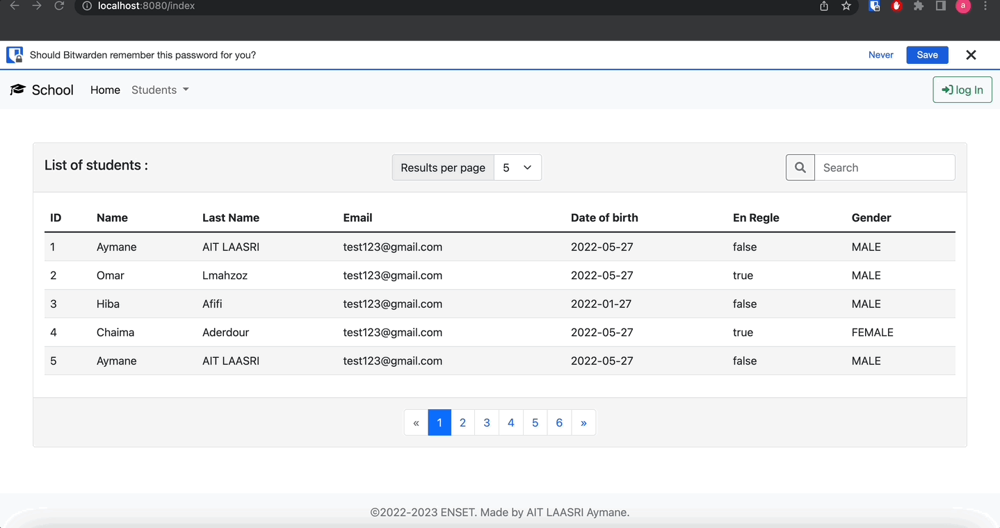
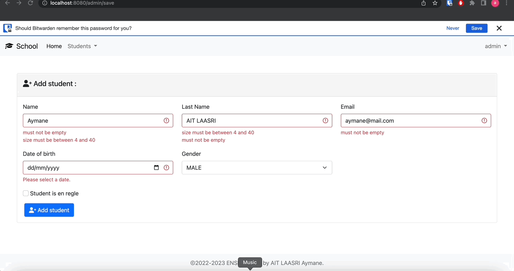
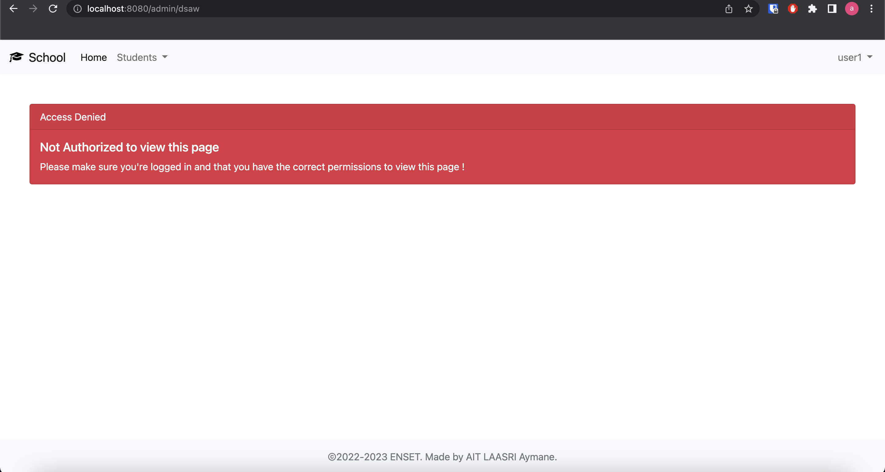
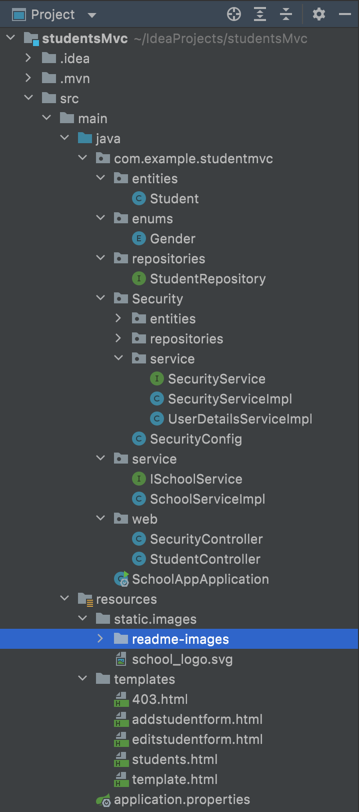
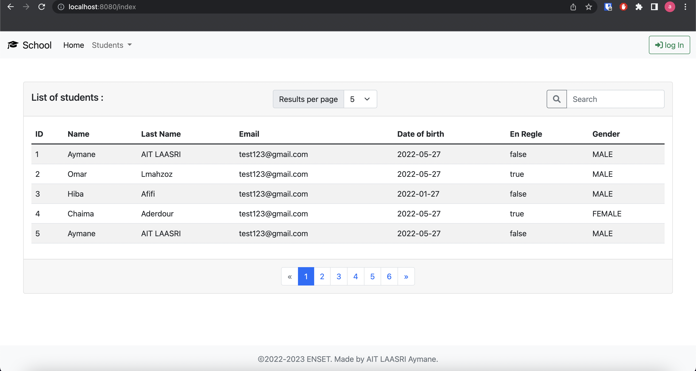
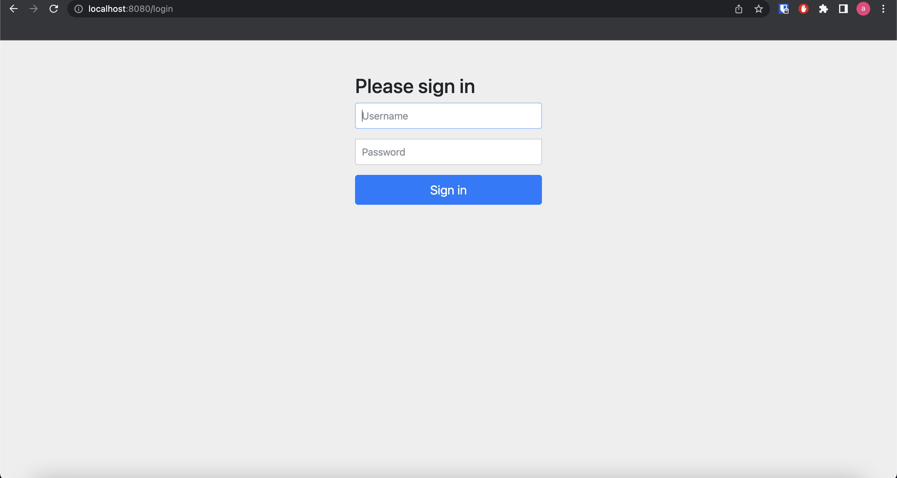
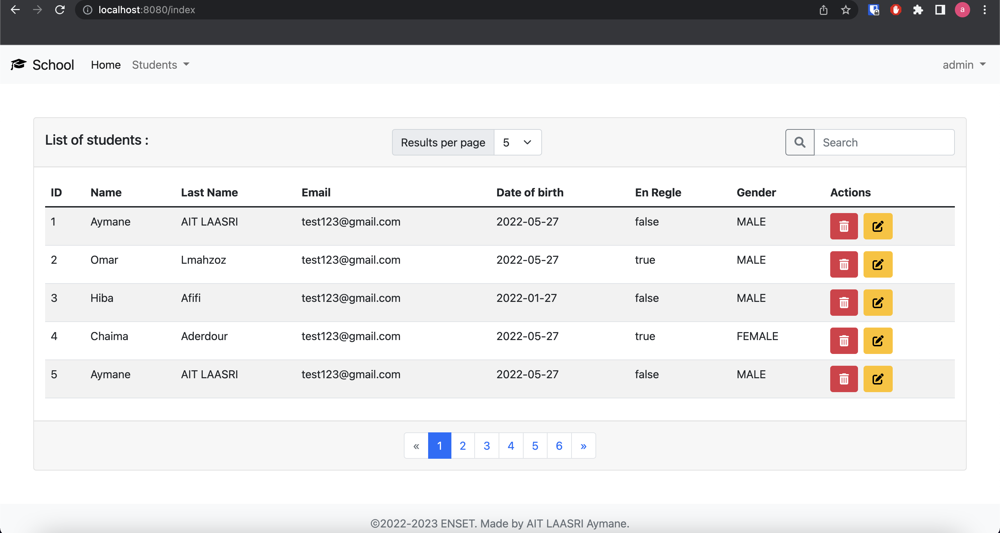
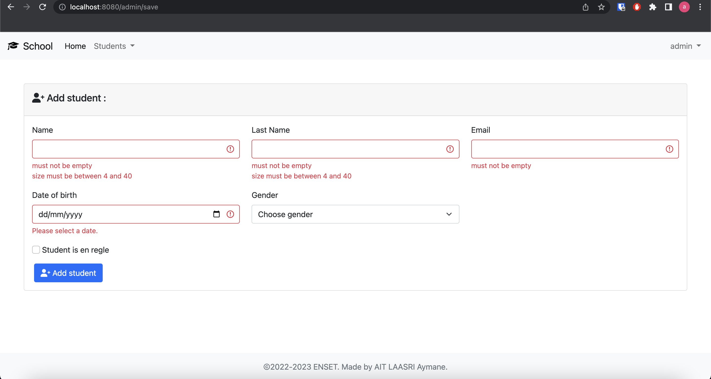
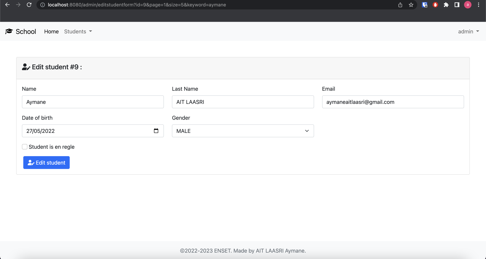

# SpringMVC
- This project is a web application using a Mysql database for managing a school's **students**.





## Technologies :

- SpringMVC
- Spring Data JPA
- Thymeleaf `as template engine`
- Spring Security
- MySQL

## Entities:
**1. The entity :**

This application only needs to manage one entity which is the `Student` entity, this entity is defined by :
- id
- name
- last name
- email
- date of birth
- regle `wether the student is on regle or not.`
- gender

```Java
@Entity
@Data @AllArgsConstructor @NoArgsConstructor @ToString // Data is for getters and setters
public class Student {
    @Id @GeneratedValue(strategy = GenerationType.IDENTITY)
    private Long id;
    @NotEmpty @Size(min = 4, max = 40) //Spring Validation for forms
    private String name;
    @NotEmpty @Size(min = 4, max = 40) //Spring Validation for forms
    private String lastName;
    @NotEmpty
    @Email //Spring email Validation for forms
    private String email;
    @Temporal(TemporalType.DATE)
    @DateTimeFormat(pattern = "yyyy-mm-dd")
    @NotNull //Spring Validation for forms
    private Date dateOfBirth;
    private boolean enRegle;
    @Enumerated(EnumType.STRING)
    private Gender gender;
}
```
With `Gender` :
```Java
public enum Gender {
    MALE,
    FEMALE
}

```

**2. Repository :**

```Java
public interface StudentRepository extends JpaRepository<Student, Long> {
    Student findByName(String name);
    Page<Student> findByNameContains(String keyword, Pageable pageable);
}
```
In this repository we have 2 function, but we will also be working with some of the standard JPA repository functions.

## What we do in this app

This application is able to manage patients by :

- Showing all students
- Search for students by name
- Deleting a student `when autheticated as admin`
- Adding or modifying an existing student `when autheticated as admin`

## Security and authentication with Spring Security

The index page can be accessed by everyone however the add and modify page can only be accessed only by users who have the admin role.
Only users with the admin role can perform the delete/add/modify actions.

>403 Forbidden page :



The authentification system is based on using User Details Service:

```Java
@Service
public class UserDetailsServiceImpl implements UserDetailsService {
    @Autowired
    private SecurityService securityService;
    @Override
    public UserDetails loadUserByUsername(String username) throws UsernameNotFoundException {
        AppUser appUser = securityService.loadUserByUsername(username);
        Collection<GrantedAuthority> authorities = new ArrayList<>();
        appUser.getUserRoles().forEach(appRole -> {
            SimpleGrantedAuthority authority = new SimpleGrantedAuthority(appRole.getRole());
            authorities.add(authority);
        });

        Collection<GrantedAuthority> authorities1 = appUser.getUserRoles().stream().map(
                role -> new SimpleGrantedAuthority(role.getRole()))
                .collect(Collectors.toList());

        User user = new User(appUser.getUsername(), appUser.getPassword(), authorities);
        return user;
    }
}
```
>AppUser :
```Java
@Entity
@Data @AllArgsConstructor @NoArgsConstructor @ToString
public class AppUser {
    @Id
    private String userID;
    @Column(unique = true)
    private String username;
    private String password;
    private boolean active;
    @ManyToMany(fetch = FetchType.EAGER)
    private List<AppRole> userRoles = new ArrayList<>();
}
```
>AppRole :
```Java
@Entity
@Data @AllArgsConstructor @NoArgsConstructor
public class AppRole {
    @Id @GeneratedValue(strategy = GenerationType.IDENTITY)
    private Long roleID;
    private String role;
}
```
Security configuration :
```JAVA
@Configuration
@EnableWebSecurity
public class SecurityConfig extends WebSecurityConfigurerAdapter {
    @Autowired
    private UserDetailsServiceImpl userDetailsService;
    @Override
    protected void configure(AuthenticationManagerBuilder auth) throws Exception {

        auth.userDetailsService(userDetailsService);

    }

    @Override
    protected void configure(HttpSecurity http) throws Exception {
        http.formLogin();
        http.authorizeRequests().antMatchers("/", "/index/**", "/webjars/**", "/resources/**", "/static/**", "/images/**" ).permitAll();
        http.authorizeRequests().antMatchers("/admin/**" ).hasAuthority("ADMIN");
        http.authorizeRequests().antMatchers("/user/**" ).hasAuthority("USER");
        http.authorizeRequests().anyRequest().authenticated();
        http.exceptionHandling().accessDeniedPage("/403");
    }
}
```
## Project Structure


## How this application works

>Index :


>login :


>admin view :


>add patient form with validation :



>modify patient with validation :


